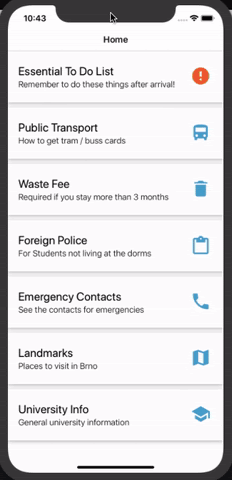
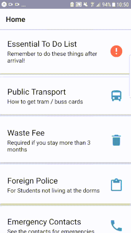

# Hand book app

Our application is a survival guide for students in Brno, mainly targeted at incoming foreign students to collect and present all the necessary information a new student would need to thrive. There is a lot of information the first few weeks and a lot of things to remember. Our application would solve the problem of information overload and different information sources, gathering it in one application, available offline after the initial download. It contains a to-do list with the essentials and guides for getting tram cards and other important procedures. ALso the application was aimed to be scalable in sense of information and easily updatable.

# howcase




# Technologies used:

- React Native
- Expo 
- Visual Studio Code 
- XCode (testing on iOS)
- Git


## Installation

```sh
1) npm install 
2) npm run android / npm run ios
```

## Used Resources
- Stackoverflow.com
- React Native Documentation
- Expo Documentation
- Material.io - for material design
- React Navigation Documentation


## Meta

Domantas Mikelionis - https://github.com/DomantasMk / https://www.linkedin.com/in/domantas-mikelionis-36aa84172/  
Øistein Haugland - https://github.com/oisteinhaugland / https://www.linkedin.com/in/oisteinhaugland/

# appdevBrno-nowedont

## Usefull links:
Trello-board: https://trello.com/b/1SN1RyKd/no-board

## Apk download
(The link may expire after some time, if you have any interest in trying out drop any of us a message)
https://exp-shell-app-assets.s3.us-west-1.amazonaws.com/android/%40makenzis/HandbookBrno-d82f35b3f4ec49f49d88b0163b6058d2-signed.apk
